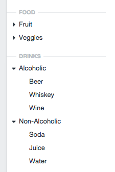

# Category Sources plugin for Craft

This plugin makes it possible to view your entries by their category-based taxonomies, by adding category-based sources to entries’ source lists.

## Installation

To install Category Sources, follow these steps:

1.  Upload the categorysources/ folder to your craft/plugins/ folder.
2.  Go to Settings > Plugins from your Craft control panel and enable the Category Sources plugin.
3.  Click on “Category Sources” to go to the plugin’s settings page, and configure the plugin how you’d like.

## Changelog

### 1.1

- Updated to take advantage of new Craft 2.5 plugin features.

### 1.0

- Initial release
